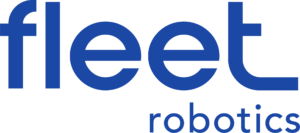

# FleetView

<div align="center">



[](https://nextjs.org/)
[](https://threejs.org/)
[](https://www.typescriptlang.org/)
[](https://reactjs.org/)
[](LICENSE)

A professional-grade 3D model viewer built for Fleet Robotics, featuring advanced visualization capabilities and intuitive controls.

[Features](#features) • [Installation](#installation) • [Usage](#usage) • [Development](#development) • [Technologies](#technologies)

</div>

## Features

### 🎨 Advanced Visualization
- Support for multiple 3D file formats:
  - STL (Standard Triangle Language)
  - OBJ (Wavefront Object)
  - GLB/GLTF (GL Transmission Format)
- Three distinct viewing modes:
  - 🌈 Colored View - Full material and texture support
  - 📐 Wireframe View - Geometric line representation
  - 🔲 Smooth View - Textured monochromatic display

### 🎮 Interactive Controls
- Intuitive camera manipulation:
  - Full 360° model rotation
  - Smooth pan and zoom capabilities
  - Dynamic perspective adjustment
- Enhanced zoom range for detailed inspection
- Responsive and fluid interaction

### 💻 Technical Highlights
- Real-time rendering with Three.js
- Optimized performance for large models
- Automatic model centering and scaling
- Responsive design for all screen sizes

## Installation

1. Clone the repository:
   ```bash
   git clone https://github.com/your-username/fleet-view.git
   cd fleet-view
   ```

2. Install dependencies:
   ```bash
   npm install
   ```

## Usage

1. Start the development server:
   ```bash
   npm run dev
   ```

2. Open your browser and navigate to [http://localhost:9002](http://localhost:9002)

3. Upload your 3D model using the "Upload 3D Model" button

4. Interact with the model:
   - Left click + drag to rotate
   - Right click + drag to pan
   - Scroll to zoom
   - Use the view mode toggle to switch between visualization styles

## Development

### Prerequisites
- Node.js 20.x or higher
- npm 10.x or higher

### Available Scripts
- `npm run dev` - Start development server
- `npm run build` - Create production build
- `npm run start` - Start production server
- `npm run lint` - Run ESLint
- `npm run typecheck` - Run TypeScript compiler checks

## Technologies

### Core
- [Next.js](https://nextjs.org/) - React framework for production
- [Three.js](https://threejs.org/) - 3D graphics library
- [React](https://reactjs.org/) - UI library
- [TypeScript](https://www.typescriptlang.org/) - Type safety

### UI/UX
- [Tailwind CSS](https://tailwindcss.com/) - Utility-first CSS
- [Radix UI](https://www.radix-ui.com/) - Accessible component system
- [Lucide Icons](https://lucide.dev/) - Beautiful icons

### Development Tools
- ESLint - Code linting
- TypeScript - Static type checking
- Turbopack - Fast bundling

## License

This project is licensed under the MIT License - see the [LICENSE](LICENSE) file for details.

## Contributing

Contributions are welcome! Please feel free to submit a Pull Request.

---

<div align="center">
Made with ❤️ by Fleet Robotics
</div>
